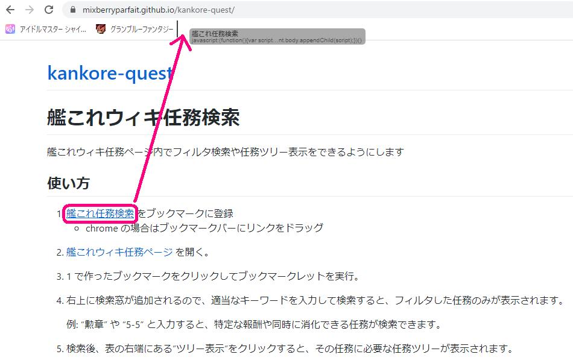
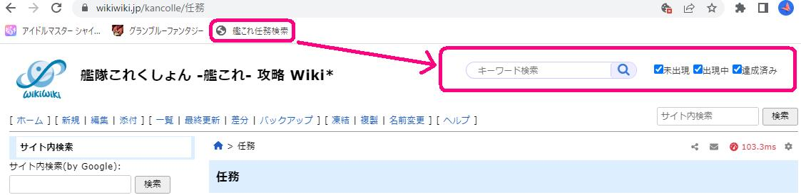
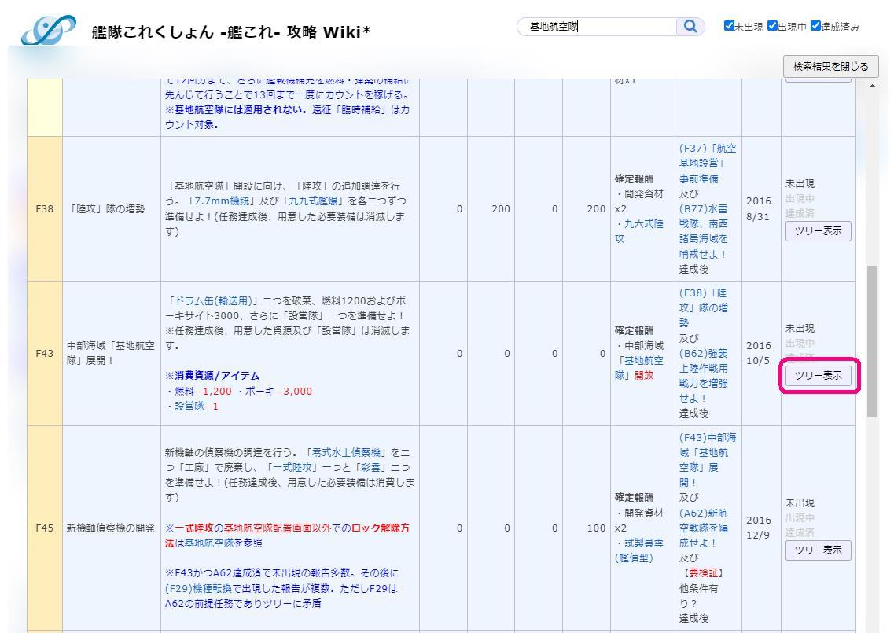
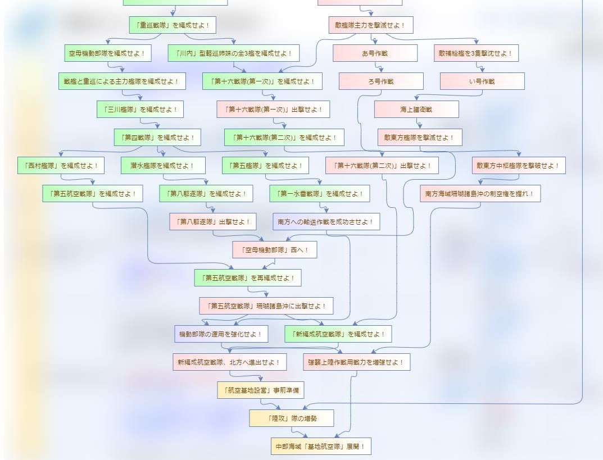

# 艦これウィキ任務検索

艦これウィキ任務ページ内でフィルタ検索や任務ツリー表示をできるようにします

## 使い方

1. [艦これ任務検索](javascript:(function(){var script=document.createElement('script');script.src='https://mixberryparfait.github.io/kankore-quest/main.js';document.body.appendChild(script);})())
 をブックマークに登録
 - chrome の場合はブックマークバーにリンクをドラッグ

 

2. [艦これウィキ任務ページ](https://wikiwiki.jp/kancolle/任務) を開く。

3. 1 で作ったブックマークをクリックしてブックマークレットを実行。

  

4. 右上に検索窓が追加されるので、適当なキーワードを入力して検索すると、フィルタした任務のみが表示されます。

   例: "勲章" や "5-5" と入力すると、特定な報酬や同時に消化できる任務が検索できます。

  

5. 検索後、表の右端にある"ツリー表示"をクリックすると、その任務に必要な任務ツリーが表示されます。

  

## 仕様

任務テーブルの８場番目のセル(開放条件/備考列)の　#id-* リンクから前提任務のデータを作っています

対応漏れがあったら連絡ください

当然ウィキのフォーマットが変わったら動かなくなります

## 連絡先

Twitter: @mixberryparfait

バグ　要望　その他なにかあれば連絡お願いします
